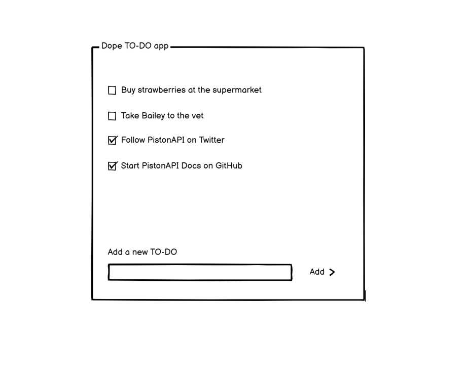

# Intermediate Tutorial

## Create a TO-DO app

### What we are building

In this tutorial, we are building a simple **to-do app** backend. A **to-do app** is a classic exercise in computer science. The goal is for the user to be able to add many TO-DO items (that can be a simple phrase describing a task) like 'Buy strawberries at the supermarket' and at any moment mark as a completed task.

In the API perspective, we will need one endpoint to add a new TO-DO, another to mark a TO-DO-ITEM as completed and, the last one is to retrieve all TO-DO-ITEM.

Only registered users will be able to create to-dos items. And also, User A must be not able to see or manage the to-do items of User B, so we gonna have to work on some permissions and filtering.

### 1 - Create a new project at PistonAPI

After you log in on your account dashboard at [pistonapi.com](https://pistonapi.com), click on New Project to create a new project for our tutorial. Choose a Project Name and click on **Create Project**. When choosing a project name have in mind that this name will go on the URL of your endpoints in the format of `https://api.pistonapi.com/<YOUR_PROJECT_NAME>`.

::: tip
There are some constraints around the project name. It must be unique in the entire PistonAPI, must start with a letter, and contain only letters, numbers, hyphens, and underscores.
:::

