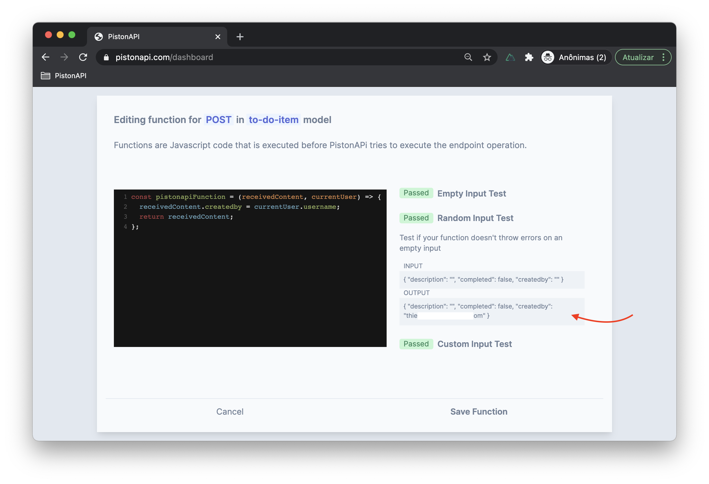

# Intermediate Tutorial

## Create a TO-DO app

### What we are building

In this tutorial, we are building a simple **to-do app** backend. A **to-do app** is a classic exercise in computer science. The goal is for the user to be able to add many `to-do-item` (that can be a simple phrase describing a task) like 'Buy strawberries at the supermarket' and at any moment mark as a completed task.


In the API perspective, we will need one endpoint to add a new `to-do-item`, another to mark a `to-do-item` as completed and, the last one is to retrieve all `to-do-item` available.

Only registered users will be able to create a `to-do-item`. And also, **User A** must be not able to see or manage the `to-do-item` of **User B**, so we gonna have to work on some permissions and filtering.

### 1 - Create a new project at PistonAPI

After you log in on your account at [pistonapi.com](https://pistonapi.com), click on **New Project** to create a new project for our tutorial. Choose a **Project Name** and click on **Create Project**. When choosing a project name have in mind that this name will go on the URL of your endpoints in the format of `https://api.pistonapi.com/<YOUR_PROJECT_NAME>`.

 

::: tip
There are some constraints around the project name. It must be unique in the entire PistonAPI, must start with a letter, and contain only letters, numbers, hyphens, and underscores.
:::

In this tutorial, we choose `tutorial-todo-app` as the Project Name. 

### 2 - Create a new model

Now we need to create a new model. A model represents something that will be manipulated (created, edited, etc) on your project. In this case, we want to create a model that represents each `to-do-item`. So, click on **New Model** on the left and you be presented to the new model screen.

In this screen, you have to set two informations. The model name and its attributes. Given that the new model will represent a `to-do-item`, a good call will be `to-do-item`.

::: tip
Keep in mind that are also some contraints about the model name. It will go in the url of the API endpoint, right after the project name like `https://api.pistonapi.com/<YOUR_PROJECT_NAME>/<YOUR_MODEL_NAME>`so it must be an unique name **in that project**.
:::


Now you will have to set these model attributes. An attribute is a place to hold some information on each item of your model. Since that this model is about a `to-do-item` we will have three attributes: 
* **description** - That will be a string type attribute that will contain a text that describle the `to-do-item`.
* **completed** - That will be a boolean type attribute that will represent if the `to-do-item` is completed or not.
* **createdby** - That will be special. It's an attribute that will not likely show to the final user. Will be string type and used to specify which user created that `to-do-item`. This is essential to restrict the viewing and editing of the `to-do-item` only to their owners.


This is how the screen should looks like with all the correct new model configuration. Now click on **Create Model** button.

###  3 - Configuring the endpoint to create a new `to-do-item`

Now we already have the endpoint for creating a new `to-do-item`. In this example, it is a **POST** request on the URL `https://api.pistonapi.com/tutorial-todo-app/to-do-item`
But it has two issues. The first one is that it has the default permission, which only allows calls of authenticated users with the type `root`. As said before we want any authenticated user to be able to create a `to-do-item`.

::: tip
Later on, we will see some examples of user authentication. But if you want to learn more, there is also official documentation about this topic.
:::

Fortunately, fixing that is easy. It's just some configuration adjustments. Go to **POST** endpoint permissions (as the image below points).


We have three available options. And the one that we gonna use is **Custom User Type**. This type of permissions makes PisonAPi check if there is an authenticated user and if that user has the specified type. Only if these two checks are true the requested action will be performed.

 Because we want any type of authenticated user to be able to create a `to-do-item`, we need to specify any user type. The user-type field accepts regex patterns. We can set the pattern below that will be enough to accept any user-type.
```regex
.+
```
 ::: tip
 To learn more about regex patterns you can check the official documentation.
 :::
Once the permission is saved, the endpoint will accept calls from any authenticated user. First issue solved ✔️.

The second issue is that the `createdBy` attribute can be arbitrary set by the request content. There is no guarantee that the content will actually represent the user that made the create `to-do-item` request.

To fix that we gonna edit the endpoint function. A endpoint function is a Javascript function that is executed internally on PistonAPI before it tries to perfom the pretended action on that endpoint. Go to the **Function** option on the **POST** endpoint. The default function is:

```javascript
const pistonapiFunction = (receivedContent, currentUser) => {
  return receivedContent;
};
```

That is basically returning the `receivedContent` without doing anything else. The `receivedContent` is exactly the **JSON** content sent by the endpoint caller. Here we have the oportunite to set a value to `createdBy` attribute that will overwrite any value provided by the caller.

Let's make a small modification and inspect the result. Adding the line `receivedContent.createdby = "Test";` right before the returning value:

```javascript
const pistonapiFunction = (receivedContent, currentUser) => {
  receivedContent.createdby = "Test";
  return receivedContent;
};
```

If you click on **Random Input Test** you can inspect a test against the function with an input of random values. With that function, the `createdby` value will be always `Test` regardless of what was originally provided on the request. 


But we don't need a fixed value, we need a unique value related to the authenticated user. Fortunately, that is very easy on PistonAPI. The `currentUser` variable contains an object with the authenticated user attributes (name, username, and type). The username must be unique across all users. If we replace the recently added line with `receivedContent.createdby = currentUser.username;`:

```javascript
const pistonapiFunction = (receivedContent, currentUser) => {
  receivedContent.createdby = currentUser.username;
  return receivedContent;
};
```

Voilà! Here we have a function that will replace any received value on the `createdby` with the username of the authenticated user.



::: tip
Keep in mind that the `currentUser` will be always filled because of the permission that we set before. If you change the permission to `public`, for example, the endpoint could be called without any authentication at all. That will throw an error on the function because the `currentUser` will be empty, result in an error response to the endpoint caller.
:::


###  4 - Configuring the endpoint to mark the `to-do-item` as completed.

Now let's think about the **PATCH** endpoint. There is a bunch of treatments that we could do on that endpoint, but we gonna focus on three things. 

First, adjust the permissions to the same as we did on the **POST** endpoint. Go to the permissions option, set it to **Custom User Type**, and put the same regex pattern that we used before.

Second, we want to avoid the modification of the `createdby` attribute. After all, the creator of the item will never be modified. So, we gonna adjust the function of this endpoint. Let's add a line that will delete any content on this attribute. This way only content of other attributes will proceed to perform the update action.

```javascript
const pistonapiFunction = (receivedContent, currentUser) => {
  delete receivedContent.createdby;
  return receivedContent;
};
```

Now any content passed to `createdby` attribute will be deleted and consequently will never be updated.

The third issue is peculiar. There is a kind of vulnerability to the current configuration of this endpoint. Take a second to try to guess. 👀

The issue is that anyone can update values of any `to-do-item`. We want to only the owner of the `to-do-item` be able to update then. To fix that we gonna use another feature of PisonAPI, called **Enforced Filter**. 

Before adding an **Enforced Filter**, let take a look at **Filters**. **Filters** is a query parameter that you can use on the **GET** endpoint URL to filter the returned data. You can check full documentation on the various options that **Filters** can apply. But here, we will only need the simplest use case. If you add 

```
?filter[createdby]=Test
```

To the **GET** endpoint it will filter the data to only retrieve `to-do-item` that have the `createdby` attribute equals to `Test`. 

An **Enforced Filter** is a filter that you can configure to be applied to restrict the data that can be affected by some action. For example, if you add `filter[createdby]=Test` to the **PATCH** endpoint only `to-do-item` that have the `createdby` attribute equals `Test` will be affected. Any attempt to do update unmatched items will result in a not-found error. 

On an **Enforced Filter** you can also use a special keyword `$currentUser`. With that, you have access to the authenticated user that is making the request.

That way, the **Enforced Filter** that we gonna use to address the last issue is:

```
filter[createdby]=$currentUser.username
```

This way, only items with the `createdby` attribute equal to the current user username can be affected, restricting the editing only for the item owners.

To set this **Enforced Filter** go to enforced filter option at the endpoint and type the filter.

###  5 - Configuring the endpoint to get all `to-do-item`.

The last endpoint that we need to configure is the **GET** endpoint. It will be responsible for retrieving the `to-do-item`. But no new concepts will be used. We have to set the same permissions as before, and the same **Enforced Filter**. That way we gonna guarantee that every registered user can call this endpoint and will only obtain your own `to-do-item` items.

### 6 - Let's run some tests.

We are ready to test our backend. Let's do together a complete life cycle of the user. 

::: warning
Remember that in my case the project name is **tutorial-todo-app** and the main model is **to-do-item** so your URL will be slightly different. Make sure you replace  with the correct values.
:::

The user will starting by creating a new username through the **POST** endpoint of the `users` model. In my case, the URL will be  **https://api.pistonapi.com/tutorial-todo-app/users**. This is an example of content to create a new username. We don't need to set the type attribute, the `default` type will be fine.

``` json
{
    "username": "tutorial-test",
    "password": "super-secret"
}
```
_POST content to https://api.pistonapi.com/tutorial-todo-app/users_

The response should be a JSON with the username, user type, and it's ID.

``` json
{
  "username": "tutorial-test",
  "type": "default",
  "id": "np4fvzghl9"
}
```

Now let's authenticate with this user. It's again a **POST** request but the URL will be **https://api.pistonapi.com/tutorial-todo-app/auth**. The content will be the username and password.

``` json
{
    "username": "tutorial-test",
    "password": "super-secret"
}
```
_POST content to https://api.pistonapi.com/tutorial-todo-app/auth_

The response should be something like

``` json
{
  "authenticationToken": "eyJhbGciOiI6IkpXVCJ9.eyJ1c2V0.Md50w2Z_l74xVinGEUQA"
}
```

This is an `authentication token` that will be on the header of the next requests. the format should be `authorization: Bearer <Authentication Token>`

Now let's add some `to-do-item`. If you try to create a new `to-do-item` through the **POST** endpoint without any authentication token you will get an **unauthorized error**.

Let's create the first `to-do-item`. It's a **POST** request to the URL `https://api.pistonapi.com/tutorial-todo-app/to-do-item`. You can ommit the `createdby` attribute. The JSON content is something like:

``` json
{
  "description": "Follow PistonAPI at Twitter",
  "completed": false
}
```

The response will be something like:

``` json
{
  "description": "Follow PistonAPI at Twitter",
  "completed": false,
  "createdby": "tutorial-test",
  "id": "buof2h9ja1"
}
```

Now if you call the **GET** endpoint, you be able to retrieve the recently created item. Make sure you inform the `authentication token`. 

Remember that if you create an item with other user (using other `authentication token`), the **GET** endpoint will only retrieve the items of the user of the `authentication token`.


### 7 - Conclusion

So, we build a very cool backend here. Two keypoints:

The flexibility of the endpoint Function that can be used to add business logic to your endpoints. There is a lot that you can add to our example, like validating to the `TO-DO-ITEM` content, or default value etc.

The Enforced Filter that can be used to personlize the response accordiling to the current user.


