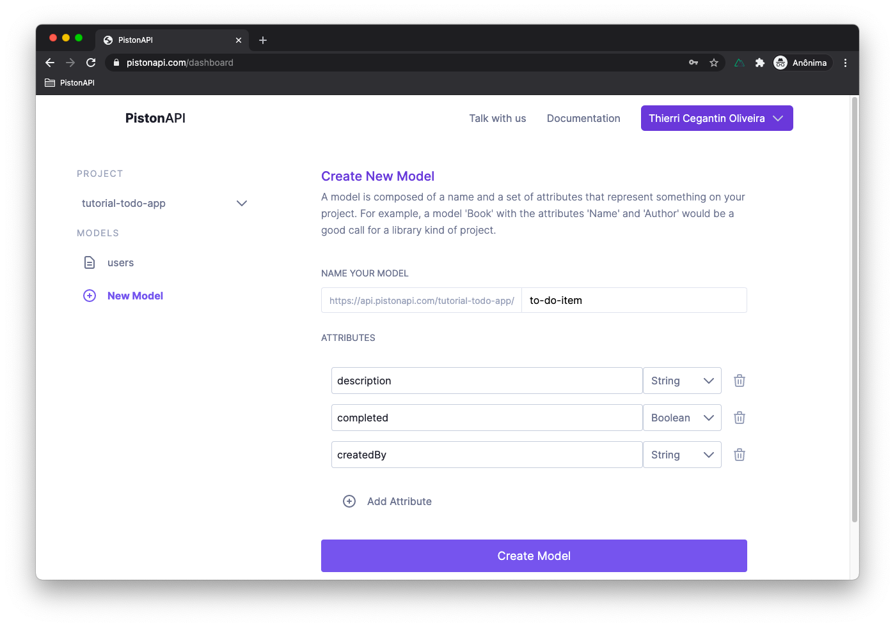

# Intermediate Tutorial

## Create a TO-DO app

### What we are building

In this tutorial, we are building a simple **to-do app** backend. A **to-do app** is a classic exercise in computer science. The goal is for the user to be able to add many TO-DO items (that can be a simple phrase describing a task) like 'Buy strawberries at the supermarket' and at any moment mark as a completed task.

In the API perspective, we will need one endpoint to add a new TO-DO, another to mark a TO-DO-ITEM as completed and, the last one is to retrieve all TO-DO-ITEM.

Only registered users will be able to create to-dos items. And also, User A must be not able to see or manage the to-do items of User B, so we gonna have to work on some permissions and filtering.

### 1 - Create a new project at PistonAPI

After you log in on your account dashboard at [pistonapi.com](https://pistonapi.com), click on **New Project** to create a new project for our tutorial. Choose a **Project Name** and click on **Create Project**. When choosing a project name have in mind that this name will go on the URL of your endpoints in the format of `https://api.pistonapi.com/<YOUR_PROJECT_NAME>`.

::: tip
There are some constraints around the project name. It must be unique in the entire PistonAPI, must start with a letter, and contain only letters, numbers, hyphens, and underscores.
:::

In this tutorial, we choose `tutorial-todo-app` as the Project Name. 

### 2 - Create a new model

Now we need to create a new model. A model represents something that will be manipulated (created, edited, etc) on your project. In this case, we want to create a model that represents each to-do item. So, click on **New Model** on the left and you be presented to the new model screen.

In this screen, you have to set two informations. The model name and its attributes. Given that the new model will represent a to-do item, a good call will be `to-do-item`.

::: tip
Keep in mind that are also some contraints about the model name. It will go in the url of the API endpoint, right after the project name like `https://api.pistonapi.com/<YOUR_PROJECT_NAME>/<YOUR_MODEL_NAME>`so it must be an unique name **in that project**.
:::

Now you will have to set these model attributes. An attribute is a place to hold some information on each item of your model. Since that this model is about a `to-do-item` we will have three attributes: 
* `description` That will be a string type attribute that will contain a text that describle the `to-do-item`.
* `completed` That will be a boolean type attribute that will represent if the `to-do-item` is completed or not.
* `createdBy` That will be special. It's an attribute that will not likely show to the final user. Will be string type and used to specify which user created that `to-do-item`. It's essential to restrict the viewing and editing of the `to-do-item` only to their owners.

This is how the screen should looks like with all the correct new model configuration. Now click on **Create Model** button.

###  3 - Configuring the endpoint to create a new `to-do-item`

Now we already have the endpoint for creating a new `to-do-item`. In this example, it is a **POST** request on the URL `https://api.pistonapi.com/tutorial-todo-app/to-do-item`
 But it has two issues. The first one is that it has the default permission, which only allows calls with authentication of a user of your project with the type `root`. As said before we want any authenticated user to be able to create a `to-do-item`.

::: tip
Later on, we will see some examples, but if you want to deep learn more about project authentication will go to the official documentation.
:::

 To configure that, go to **POST** endpoint permissions as the image below points. The option that we will choose is **Custom User Type** where PisonAPi checks if the user is authenticated and if the user type is the specified one before trying to perform the requested action.

 Because we want any authenticated user to be able to create a 

 But the issue is that the createdBy field can be arbritrary setted by the caller.