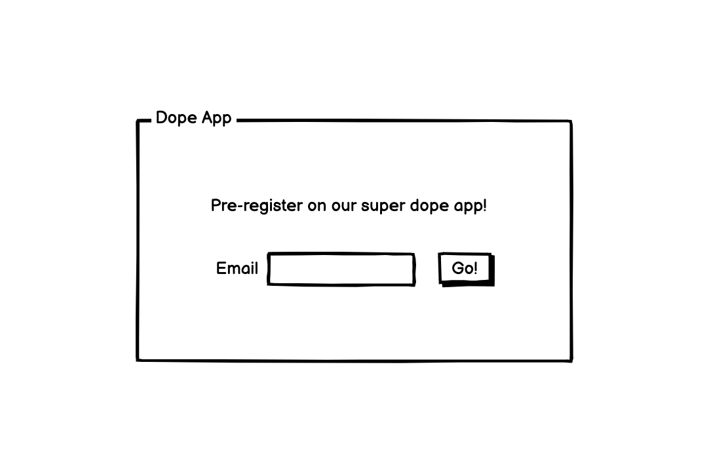
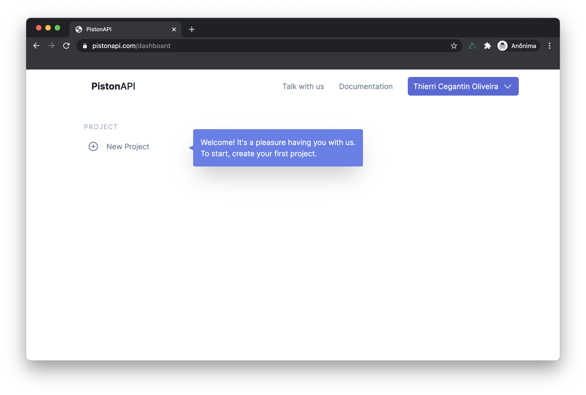
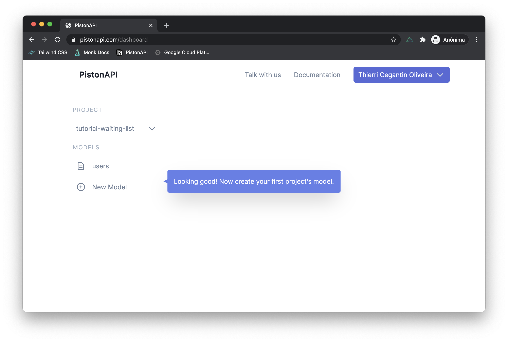
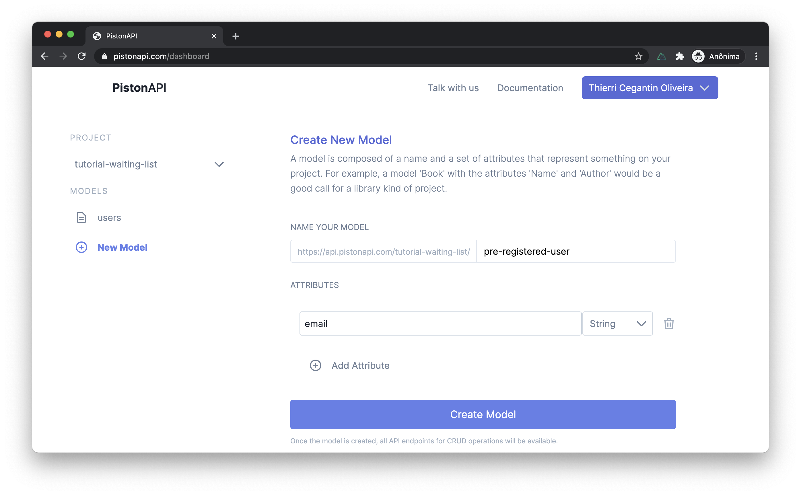

# Beginner Tutorial

## Create an Waiting List backend feature

### What we are building

In this tutorial, you will learn how to set up a backend for a waiting list feature. Before digging-in in the which APIs we will be creating, let's take a look at the user experience.

**In the frontend**,  a simple form where the users type their email (and maybe others info too) to submit to a pre-register.

_The frontend wireframe example._

**In the admin area**, users with right permissions should be able to retrieve all submited data.

To meet these requirements we will need **two APIs endpoints**. The first one is used for the register of new user in the waiting list. This should be public, where anyone can call it, even without any authentication.

The second is used to get all registered users. But this one must be restricted to authenticated users only.

### 1 - Create a new project at PistonAPI

In order to setup the needed API endpoint, you will have to go to [pistonapi.com](https://pistonapi.com) and create a new project. This is pretty straightforward. After you login at PistonAPI you should see a screen like this (if you have no projects created yet).

Click on **New Project** on the left side, then you be presented to the screen where you have to choose your project name. When choosing a project name have in mind that this name will go on the URL of your endpoints in the format of **https://api.pistonapi.com/{project name}/**.

::: tip
There are some constraints around the project name. It must be unique in the entire PistonAPI and contain only letters, numbers, hyphens, and underscores (starting with a letter).
:::

After choosing, just click on Create Project. 😊 In our example, we choose **tutorial-waiting-list** as the Project Name. 

### 2 - Create a new model

 This is the screen after you created your new project. Note that the project comes with a model called **Users**. We are not using that model on this project (if you want to check more about it, go to the [Users Model Documentation](/documentation)).

For the waiting list, we need to create a new model. A model represents something that will be manipulated (created, edited, etc) on your project. In this case, we want to create a model that represents each pre-registered user. So, click on **New Model** on the left and you be presented to the New Model screen.

In this screen, you have to set two information. The model name and its attributes. Given that the new model will represent a pre-registered user, a good call will be **pre-registered-user**.

::: tip
Keep in mind that are also some contraints about the model name. It will go in the url of the API endpoint, right after the project name like **https://api.pistonapi.com/{project name}/{model name}** so it must be an unique name **in that project**.
:::

Now you will have to set these model attributes. An attribute is a place to hold some information on each item of your model. Since that this model is about a **pre-registered-user** an **email** is a piece of information that we want to have for each **pre-registered-user**.

Click on **Add Attribute** button. Two new fields will appear. The attribute name and its type. As said, **email** is the name that we will use and the type will be a **string**.

_This is how the screen will look like after fulfilling everything that we need for this project_

::: tip
There is four attribute types available. String that is a text, Number that is a number, Datetime that is a date and time value and Boolean that is can only be TRUE or FALSE. In our case, an email will be of type string.
:::

Click on **Create Model** button. Your model will be created and you will be redirected to the model overview screen. There you can check the total number of items, number of requests, its schemas and most important the endpoints.

PistonAPI automatically creates four endpoints with your model. At this point, you already has the endpoints that you need for your application. In the bottom of the screen you can see all endpoint and try each one.

The only issue is that all endpoints has the default permission, which is only allow calls with authentication from a root user.

A root user is a user 